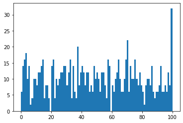

Kubeflow POC
---
# Running Spark from a pod

Create a service account and roles, run a pod based on a valid Spark image:
```
kubectl apply -f specs/rbac.yaml
kubectl run -it busybox --image=mesosphere/spark:2.4.3-bin-hadoop2.9-k8s --command bash --restart=Never --serviceaccount=spark-sa --rm
```

## spark-shell
```
/opt/spark/bin/spark-shell --master k8s://https://kubernetes.default.svc.cluster.local:443 \
--conf spark.driver.host=$(hostname -i) \
--conf spark.kubernetes.namespace=spark \
--conf spark.kubernetes.authenticate.driver.serviceAccountName=spark-sa \
--conf spark.kubernetes.container.image=mesosphere/spark:2.4.3-bin-hadoop2.9-k8s
```

## spark-submit (cluster mode)
```
/opt/spark/bin/spark-submit --master k8s://https://kubernetes.default.svc.cluster.local:443 \
--deploy-mode cluster \
--conf spark.kubernetes.namespace=spark \
--conf spark.kubernetes.authenticate.driver.serviceAccountName=spark-sa \
--conf spark.kubernetes.authenticate.submission.caCertFile=/var/run/secrets/kubernetes.io/serviceaccount/ca.crt \
--conf spark.kubernetes.authenticate.submission.oauthTokenFile=/var/run/secrets/kubernetes.io/serviceaccount/token \
--conf spark.kubernetes.container.image=mesosphere/spark:2.4.3-bin-hadoop2.9-k8s  \
--class org.apache.spark.examples.SparkPi \
local:///opt/spark/examples/jars/spark-examples_2.11-2.4.3.jar 1000
```

# Jupyter integration with Spark

* run `install.sh`
* create namespace, configure roles, and install Jupyter from specs:
  ```
  kubectl apply -f specs/namespace.yaml
  kubectl apply -f specs/rbac.yaml
  kubectl apply -f specs/notebook.yaml
  ```
* verify notebook is up
* disable Istio sidecar injection by removing a label from the namespace `k label ns spark istio-injection-`
* run example notebook and check executor pods are up and actually running tasks

## Examples
### Apache Toree kernel (Scala):
```
import org.apache.spark.{SparkConf, SparkContext}
import java.net._

val localIpAddress: String =  InetAddress.getLocalHost.getHostAddress

val conf = new SparkConf()
           .setAppName("Toree test")
           .setMaster("k8s://https://kubernetes.default.svc.cluster.local:443")
           .set("spark.driver.host", localIpAddress)
           .set("spark.kubernetes.namespace", "spark")
           .set("spark.kubernetes.container.image", "mesosphere/spark:2.4.3-bin-hadoop2.9-k8s")
val sc = new SparkContext(conf)
sc.parallelize(1 to 1000).sum
```
Expected output: `500500.0`

### PySpark:
```
import pyspark
from pyspark.sql import SparkSession
import socket
from operator import add

localIpAddress = socket.gethostbyname(socket.gethostname())

conf = pyspark.SparkConf().setAll([
    ('spark.master', 'k8s://https://kubernetes.default.svc.cluster.local:443'),
    ("spark.driver.host", localIpAddress),
    ("spark.kubernetes.namespace", "spark"),
    ("spark.kubernetes.container.image", "akirillov/spark:spark-2.4.3-hadoop-2.9-k8s")])

spark = SparkSession.builder.appName("PySpark").config(conf=conf).getOrCreate()
spark.sparkContext.parallelize(range(1, 1001)).reduce(add)
```
Expected output: `500500`

#### Plotting with matplotlib
```
import matplotlib.pyplot as plt

from random import seed
from random import randint

seed(1)
data = spark.sparkContext.parallelize(range(1, 1001)).map(lambda num: randint(0, 100)).collect()
plt.hist(data, bins=100)
```
Expected output:



# Tensorflow & Horovod
## Notebooks

* [MNIST Tensorflow](notebooks/MNIST%20Tensorflow.ipynb) - a vanilla Tensorflow example for MNIST
* [MNIST Horovod](notebooks/MNIST%20Horovod.ipynb) - MNIST training using Horovod with Tensorflow (local mode, CPU)
* [Horovod Spark](notebooks/Horovod%20Spark.ipynb) - a simple example of Horovod-Spark integration
* [MNIST Horovod Spark](notebooks/MNIST%20Horovod%20Spark.ipynb) - MNIST training using Horovod with Tensorflow for training and Spark for parallelization

# TODO
* pass namespace, master, and pod IP to configuration automatically (https://kubernetes.io/docs/tasks/inject-data-application/environment-variable-expose-pod-information/#use-pod-fields-as-values-for-environment-variables)
